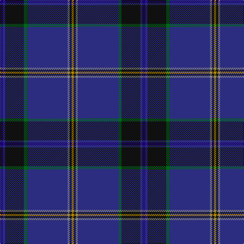

The parent of this is [Law Enforcement Officers' Mem. (Cor](/tartans/dba/6/db4/k37/g6/db80/n4/k4/dy/4/)

This was sourced from tartans-authority.  It is a [8 stripes tartan](/stripes/stripes8/).

Original link http://www.tartansauthority.com/tartan-ferret/display/7460/

## Thread count
DBa/6 DB4 K37 G6 DB80 N4 K4 DY/4

## Palette
Each colour and its ΔE from the base-6 reference it is a variant of.

| Colour | Shade | Base | ΔE (OKLab) |
|---|---|---|---|
| DB |  `#2C2C80` | B  | 0.05 |
| DBa |  `#1C0070` | B  | 0.14 |
| DY |  `#BC8C00` | Y  | 0.16 |
| G |  `#006818` | G  | 0.02 |
| K |  `#101010` | K  | 0.17 |
| N |  `#888888` | R  | 0.24 |

# Sample pattern

ID: /variants/dba/6/db4/k37/g6/db80/n4/k4/dy/4-db2c2c80-dba1c0070-dybc8c00-g006818-k101010-n888888/
