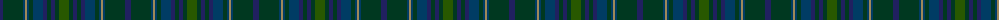

The parent of this is [Protheroe (Welsh Name)](/tartans/dba/6/dg20/db2/lt2/db2/dg4/db10/dba4/dg4/dba4/dg4/g/10/)

This was sourced from tartans-authority.  It is a [12 stripes tartan](/stripes/stripes12/).

Original link http://www.tartansauthority.com/tartan-ferret/display/5752/

## Thread count
DBa/6 DG20 DB2 LT2 DB2 DG4 DB10 DBa4 DG4 DBa4 DG4 G/10

## Palette
Each colour and its ΔE from the base-6 reference it is a variant of.

| Colour | Shade | Base | ΔE (OKLab) |
|---|---|---|---|
| DB |  `#003C64` | B  | 0.07 |
| DBa |  `#202060` | B  | 0.11 |
| DG |  `#003820` | G  | 0.16 |
| G |  `#285800` | G  | 0.04 |
| LT |  `#A08858` | Y  | 0.21 |

ID: /variants/dba/6/dg20/db2/lt2/db2/dg4/db10/dba4/dg4/dba4/dg4/g/10-db003c64-dba202060-dg003820-g285800-lta08858/
