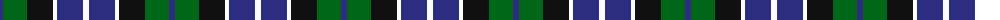

The parent of this is [Herd/Hurd](/tartans/dba/6/g24/k26/w4/dba26/w/6/)

This was sourced from register-of-tartans.  It is a [6 stripes tartan](/stripes/stripes6/).

Original link https://www.tartanregister.gov.uk/tartanDetails.aspx?ref=1691

## Thread count
DBa/6 G24 K26 W4 DBa26 W/6

## Palette
Each colour and its ΔE from the base-6 reference it is a variant of.

| Colour | Shade | Base | ΔE (OKLab) |
|---|---|---|---|
| B |  `#2474E8` | B  | 0.20 |
| DB |  `#1C0070` | B  | 0.14 |
| DBa |  `#2C2C80` | B  | 0.05 |
| G |  `#006818` | G  | 0.02 |
| K |  `#101010` | K  | 0.17 |
| N |  `#B8B8B8` | Y  | 0.17 |
| P |  `#6840FC` | B  | 0.21 |
| W |  `#FCFCFC` | W  | 0.03 |

# Sample pattern

ID: /variants/dba/6/g24/k26/w4/dba26/w/6-b2474e8-db1c0070-dba2c2c80-g006818-k101010-nb8b8b8-p6840fc-wfcfcfc/
