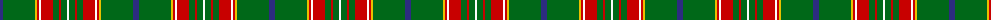

The parent of this is [Canadian Caledonian](/tartans/dba/6/g32/ya2/ra2/wa2/ra12/g6/ra2/g6/wa/2/)

This was sourced from register-of-tartans.  It is a [10 stripes tartan](/stripes/stripes10/).

Original link https://www.tartanregister.gov.uk/tartanDetails.aspx?ref=541

## Thread count
DBa/6 G32 Ya2 Ra2 Wa2 Ra12 G6 Ra2 G6 Wa/2

## Palette
Each colour and its ΔE from the base-6 reference it is a variant of.

| Colour | Shade | Base | ΔE (OKLab) |
|---|---|---|---|
| DB |  `#000048` | B  | 0.21 |
| DBa |  `#2C2C80` | B  | 0.05 |
| DG |  `#004028` | G  | 0.14 |
| G |  `#006818` | G  | 0.02 |
| R |  `#C80000` | R  | 0.00 |
| Ra |  `#C80000` | R  | 0.00 |
| W |  `#FCFCFC` | W  | 0.03 |
| Wa |  `#FCFCFC` | W  | 0.03 |
| Y |  `#DCBC00` | Y  | 0.02 |
| Ya |  `#E8C000` | Y  | 0.00 |

ID: /variants/dba/6/g32/ya2/ra2/wa2/ra12/g6/ra2/g6/wa/2-db000048-dba2c2c80-dg004028-g006818-rc80000-rac80000-wfcfcfc-wafcfcfc-ydcbc00-yae8c000/
