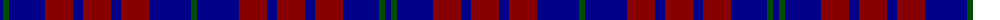

The parent of this is [Hamilton (Personal)](/tartans/dba/6/g6/dba36/dr28/db10/dr28/db10/dr28/dba42/g/6/)

This was sourced from tartans-authority.  It is a [10 stripes tartan](/stripes/stripes10/).

Original link http://www.tartansauthority.com/tartan-ferret/display/5142/

## Thread count
DBa/6 G6 DBa36 DR28 DB10 DR28 DB10 DR28 DBa42 G/6

## Palette
Each colour and its ΔE from the base-6 reference it is a variant of.

| Colour | Shade | Base | ΔE (OKLab) |
|---|---|---|---|
| DB |  `#000088` | B  | 0.14 |
| DBa |  `#000088` | B  | 0.14 |
| DR |  `#880000` | R  | 0.14 |
| G |  `#004C00` | G  | 0.08 |

ID: /variants/dba/6/g6/dba36/dr28/db10/dr28/db10/dr28/dba42/g/6-db000088-dba000088-dr880000-g004c00/
