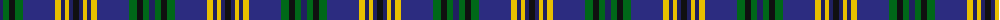

The parent of this is [St Andrews, University of](/tartans/dba/6/g6/k6/g8/db32/y6/dba4/y4/dba4/k/6/)

This was sourced from register-of-tartans.  It is a [10 stripes tartan](/stripes/stripes10/).

Original link https://www.tartanregister.gov.uk/tartanDetails.aspx?ref=3884

## Thread count
DBa/6 G6 K6 G8 DB32 Y6 DBa4 Y4 DBa4 K/6

## Palette
Each colour and its ΔE from the base-6 reference it is a variant of.

| Colour | Shade | Base | ΔE (OKLab) |
|---|---|---|---|
| DB |  `#2C2C80` | B  | 0.05 |
| DBa |  `#202060` | B  | 0.11 |
| G |  `#006818` | G  | 0.02 |
| K |  `#101010` | K  | 0.17 |
| Y |  `#E8C000` | Y  | 0.00 |

ID: /variants/dba/6/g6/k6/g8/db32/y6/dba4/y4/dba4/k/6-db2c2c80-dba202060-g006818-k101010-ye8c000/
