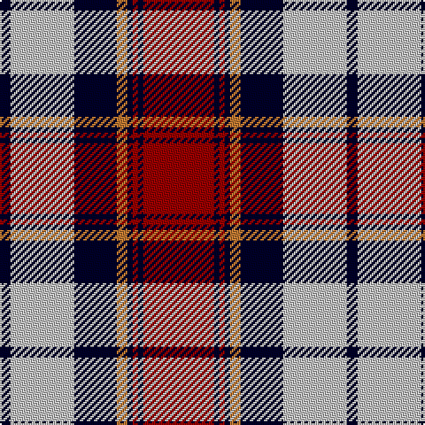

The parent of this is [Heriot #2](/tartans/dba/6/n36/dba24/do6/dba3/dr3/dba3/dr/40/)

This was sourced from register-of-tartans.  It is a [8 stripes tartan](/stripes/stripes8/).

Original link https://www.tartanregister.gov.uk/tartanDetails.aspx?ref=5847

## Thread count
DBa/6 N36 DBa24 DO6 DBa3 DR3 DBa3 DR/40

## Palette
Each colour and its ΔE from the base-6 reference it is a variant of.

| Colour | Shade | Base | ΔE (OKLab) |
|---|---|---|---|
| DB |  `#000028` | K  | 0.15 |
| DBa |  `#000028` | K  | 0.15 |
| DO |  `#BE7832` | R  | 0.17 |
| DR |  `#960000` | R  | 0.11 |
| N |  `#C0C0C0` | W  | 0.16 |

# Sample pattern

ID: /variants/dba/6/n36/dba24/do6/dba3/dr3/dba3/dr/40-db000028-dba000028-dobe7832-dr960000-nc0c0c0/
