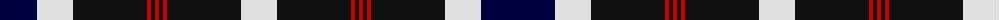

The parent of this is [Hakkarain (Personal)](/tartans/dba/74/ln36/k74/r4/k4/r4/k4/r4/k74/ln/36/)

This was sourced from register-of-tartans.  It is a [10 stripes tartan](/stripes/stripes10/).

Original link https://www.tartanregister.gov.uk/tartanDetails.aspx?ref=1570

## Thread count
DBa/74 LN36 K74 R4 K4 R4 K4 R4 K74 LN/36

## Palette
Each colour and its ΔE from the base-6 reference it is a variant of.

| Colour | Shade | Base | ΔE (OKLab) |
|---|---|---|---|
| DB |  `#2C2C80` | B  | 0.05 |
| DBa |  `#000040` | K  | 0.20 |
| K |  `#101010` | K  | 0.17 |
| LN |  `#E0E0E0` | W  | 0.06 |
| R |  `#C80000` | R  | 0.00 |
| W |  `#FCFCEC` | W  | 0.03 |

ID: /variants/dba/74/ln36/k74/r4/k4/r4/k4/r4/k74/ln/36-db2c2c80-dba000040-k101010-lne0e0e0-rc80000-wfcfcec/
