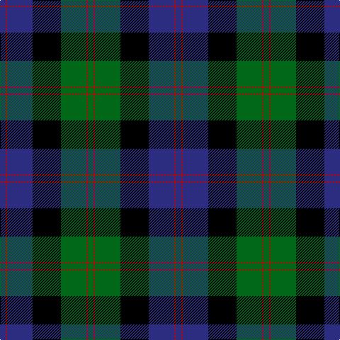

The parent of this is [Blair](/tartans/dba/8/ra2/dba36/k40/ga36/ra2/ga/8/)

This was sourced from register-of-tartans.  It is a [7 stripes tartan](/stripes/stripes7/).

Original link https://www.tartanregister.gov.uk/tartanDetails.aspx?ref=291

## Thread count
DBa/8 Ra2 DBa36 K40 Ga36 Ra2 Ga/8

## Palette
Each colour and its ΔE from the base-6 reference it is a variant of.

| Colour | Shade | Base | ΔE (OKLab) |
|---|---|---|---|
| B |  `#1474B4` | B  | 0.15 |
| DB |  `#000048` | B  | 0.21 |
| DBa |  `#2C2C80` | B  | 0.05 |
| DG |  `#044028` | G  | 0.14 |
| G |  `#408060` | G  | 0.13 |
| Ga |  `#006818` | G  | 0.02 |
| K |  `#000000` | K  | 0.00 |
| R |  `#C80000` | R  | 0.00 |
| Ra |  `#C80000` | R  | 0.00 |

# Sample pattern

ID: /variants/dba/8/ra2/dba36/k40/ga36/ra2/ga/8-b1474b4-db000048-dba2c2c80-dg044028-g408060-ga006818-k000000-rc80000-rac80000/
