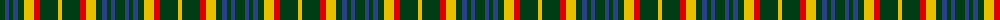

The parent of this is [Arkansas (Unofficial)](/tartans/dg/10/b4/dg4/b5/dg6/y10/r6/dg18/y/4/)

This was sourced from register-of-tartans.  It is a [9 stripes tartan](/stripes/stripes9/).

Original link https://www.tartanregister.gov.uk/tartanDetails.aspx?ref=113

## Thread count
DG/10 B4 DG4 B5 DG6 Y10 R6 DG18 Y/4

## Palette
Each colour and its ΔE from the base-6 reference it is a variant of.

| Colour | Shade | Base | ΔE (OKLab) |
|---|---|---|---|
| B |  `#2C4084` | B  | 0.00 |
| DG |  `#003C14` | G  | 0.14 |
| R |  `#DC0000` | R  | 0.04 |
| Y |  `#E8C000` | Y  | 0.00 |

ID: /variants/dg/10/b4/dg4/b5/dg6/y10/r6/dg18/y/4-b2c4084-dg003c14-rdc0000-ye8c000/
