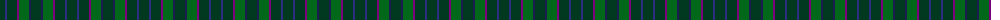
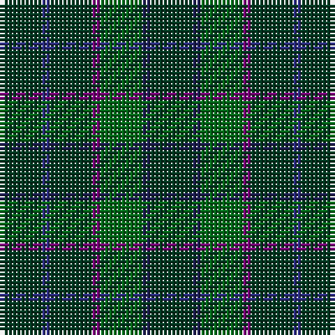

The parent of this is [Blackwood (Corporate)](/tartans/dg/10/db2/dg10/p2/g10/dba2/dg/10/)

This was sourced from tartans-authority.  It is a [7 stripes tartan](/stripes/stripes7/).

Original link http://www.tartansauthority.com/tartan-ferret/display/10201/

## Thread count
DG/10 DB2 DG10 P2 G10 DBa2 DG/10

## Palette
Each colour and its ΔE from the base-6 reference it is a variant of.

| Colour | Shade | Base | ΔE (OKLab) |
|---|---|---|---|
| DB |  `#2C2C80` | B  | 0.05 |
| DBa |  `#1C1C50` | B  | 0.14 |
| DG |  `#003820` | G  | 0.16 |
| G |  `#006818` | G  | 0.02 |
| P |  `#780078` | B  | 0.16 |

# Sample pattern

ID: /variants/dg/10/db2/dg10/p2/g10/dba2/dg/10-db2c2c80-dba1c1c50-dg003820-g006818-p780078/
