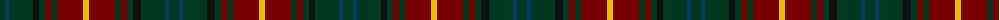

The parent of this is [Lowland Donnelly (Personal)](/tartans/dg/10/db4/dg24/k6/dg6/dr6/dg6/dr26/y6/dr26/dg6/dr6/dg6/k8/dg24/db4/dg/10/)

This was sourced from register-of-tartans.  It is a [17 stripes tartan](/stripes/stripes17/).

Original link https://www.tartanregister.gov.uk/tartanDetails.aspx?ref=10114

## Thread count
DG/10 DB4 DG24 K6 DG6 DR6 DG6 DR26 Y6 DR26 DG6 DR6 DG6 K8 DG24 DB4 DG/10

## Palette
Each colour and its ΔE from the base-6 reference it is a variant of.

| Colour | Shade | Base | ΔE (OKLab) |
|---|---|---|---|
| B |  `#007C6C` | G  | 0.13 |
| DB |  `#003C64` | B  | 0.07 |
| DG |  `#003820` | G  | 0.16 |
| DR |  `#780000` | R  | 0.18 |
| K |  `#101010` | K  | 0.17 |
| R |  `#C80000` | R  | 0.00 |
| Y |  `#E8C000` | Y  | 0.00 |

ID: /variants/dg/10/db4/dg24/k6/dg6/dr6/dg6/dr26/y6/dr26/dg6/dr6/dg6/k8/dg24/db4/dg/10-b007c6c-db003c64-dg003820-dr780000-k101010-rc80000-ye8c000/
