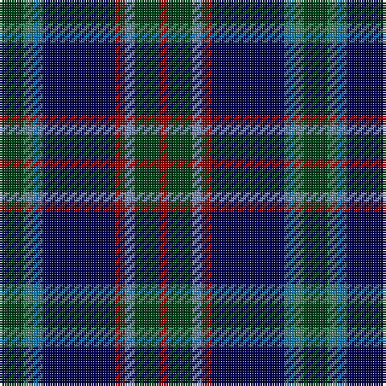

The parent of this is [Remember the Somme 1916](/tartans/dg/10/g4/ba4/db30/dr4/b4/dg10/dr/4/)

This was sourced from register-of-tartans.  It is a [8 stripes tartan](/stripes/stripes8/).

Original link https://www.tartanregister.gov.uk/tartanDetails.aspx?ref=11098

## Thread count
DG/10 G4 Ba4 DB30 DR4 B4 DG10 DR/4

## Palette
Each colour and its ΔE from the base-6 reference it is a variant of.

| Colour | Shade | Base | ΔE (OKLab) |
|---|---|---|---|
| B |  `#788CB4` | B  | 0.25 |
| Ba |  `#1870A4` | B  | 0.14 |
| DB |  `#000048` | B  | 0.21 |
| DG |  `#003C14` | G  | 0.14 |
| DR |  `#880000` | R  | 0.14 |
| G |  `#408060` | G  | 0.13 |

# Sample pattern

ID: /variants/dg/10/g4/ba4/db30/dr4/b4/dg10/dr/4-b788cb4-ba1870a4-db000048-dg003c14-dr880000-g408060/
