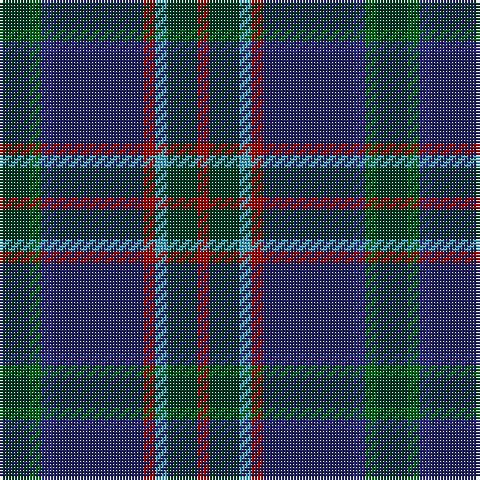

The parent of this is [Remember the Somme 1916](/tartans/dg/10/g4/db4/dba30/dr4/b4/dg10/dr/4/)

This was sourced from tartans-authority.  It is a [8 stripes tartan](/stripes/stripes8/).

Original link http://www.tartansauthority.com/tartan-ferret/display/11098/

## Thread count
DG/10 G4 DB4 DBa30 DR4 B4 DG10 DR/4

## Palette
Each colour and its ΔE from the base-6 reference it is a variant of.

| Colour | Shade | Base | ΔE (OKLab) |
|---|---|---|---|
| B |  `#48A4C0` | Y  | 0.28 |
| DB |  `#2C2C80` | B  | 0.05 |
| DBa |  `#202060` | B  | 0.11 |
| DG |  `#003820` | G  | 0.16 |
| DR |  `#A00000` | R  | 0.09 |
| G |  `#006818` | G  | 0.02 |

# Sample pattern

ID: /variants/dg/10/g4/db4/dba30/dr4/b4/dg10/dr/4-b48a4c0-db2c2c80-dba202060-dg003820-dra00000-g006818/
