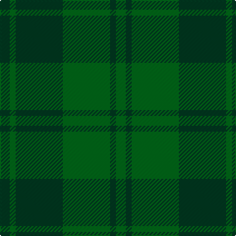

The parent of this is [Royal Scots Fusiliers (Military)](/tartans/dg/10/g6/dg48/g48/dg6/g/10/)

This was sourced from tartans-authority.  It is a [6 stripes tartan](/stripes/stripes6/).

Original link http://www.tartansauthority.com/tartan-ferret/display/5394/

## Thread count
DG/10 G6 DG48 G48 DG6 G/10

## Palette
Each colour and its ΔE from the base-6 reference it is a variant of.

| Colour | Shade | Base | ΔE (OKLab) |
|---|---|---|---|
| DG |  `#003820` | G  | 0.16 |
| G |  `#006818` | G  | 0.02 |

# Sample pattern

ID: /variants/dg/10/g6/dg48/g48/dg6/g/10-dg003820-g006818/
