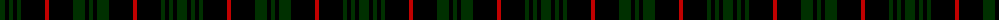

The parent of this is [MacLoughlin, Ardmarnoch](/tartans/dg/10/k4/dg4/k4/dg4/k24/r4/k24/dg12/k4/dg/4/)

This was sourced from weddslist.  It is a [11 stripes tartan](/stripes/stripes11/).

Original link http://www.weddslist.com/cgi-bin/tartans/pg.pl?source=sts

## Thread count
DG/10 K4 DG4 K4 DG4 K24 R4 K24 DG12 K4 DG/4

## Palette
Each colour and its ΔE from the base-6 reference it is a variant of.

| Colour | Shade | Base | ΔE (OKLab) |
|---|---|---|---|
| DG |  `#003000` | G  | 0.18 |
| K |  `#000000` | K  | 0.00 |
| R |  `#C00000` | R  | 0.02 |

ID: /variants/dg/10/k4/dg4/k4/dg4/k24/r4/k24/dg12/k4/dg/4-dg003000-k000000-rc00000/
