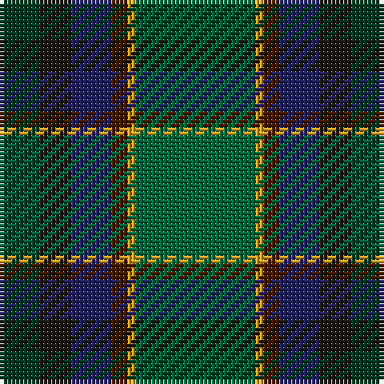

The parent of this is [Dobson (Palm Bay) (Personal)](/tartans/dg/10/k8/db10/dr4/y2/g/30/)

This was sourced from register-of-tartans.  It is a [6 stripes tartan](/stripes/stripes6/).

Original link https://www.tartanregister.gov.uk/tartanDetails.aspx?ref=10943

## Thread count
DG/10 K8 DB10 DR4 Y2 G/30

## Palette
Each colour and its ΔE from the base-6 reference it is a variant of.

| Colour | Shade | Base | ΔE (OKLab) |
|---|---|---|---|
| DB |  `#202060` | B  | 0.11 |
| DG |  `#003820` | G  | 0.16 |
| DR |  `#441800` | B  | 0.22 |
| G |  `#00643C` | G  | 0.06 |
| K |  `#1C1714` | K  | 0.21 |
| Y |  `#E0A126` | Y  | 0.08 |

# Sample pattern

ID: /variants/dg/10/k8/db10/dr4/y2/g/30-db202060-dg003820-dr441800-g00643c-k1c1714-ye0a126/
