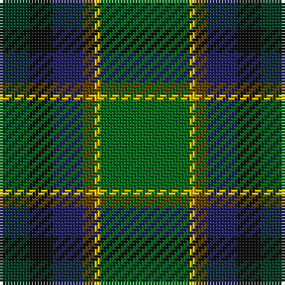

The parent of this is [Dobson (Palm Bay) (Personal)](/tartans/dg/10/k8/db10/t4/y2/g/30/)

This was sourced from tartans-authority.  It is a [6 stripes tartan](/stripes/stripes6/).

Original link http://www.tartansauthority.com/tartan-ferret/display/10943/

## Thread count
DG/10 K8 DB10 T4 Y2 G/30

## Palette
Each colour and its ΔE from the base-6 reference it is a variant of.

| Colour | Shade | Base | ΔE (OKLab) |
|---|---|---|---|
| DB |  `#202060` | B  | 0.11 |
| DG |  `#003820` | G  | 0.16 |
| G |  `#006818` | G  | 0.02 |
| K |  `#101010` | K  | 0.17 |
| T |  `#604000` | G  | 0.14 |
| Y |  `#E8C000` | Y  | 0.00 |

# Sample pattern

ID: /variants/dg/10/k8/db10/t4/y2/g/30-db202060-dg003820-g006818-k101010-t604000-ye8c000/
