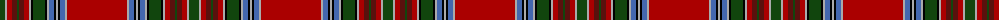

The parent of this is [MacBain](/tartans/dg/10/n2/dr5/dra5/dg2/dra5/dr5/n2/k2/dg12/k2/n2/b5/k2/n2/k2/b5/n2/dr/60/)

This was sourced from weddslist.  It is a [19 stripes tartan](/stripes/stripes19/).

Original link http://www.weddslist.com/cgi-bin/tartans/pg.pl?source=x

## Thread count
DG/10 N2 DR5 DRa5 DG2 DRa5 DR5 N2 K2 DG12 K2 N2 B5 K2 N2 K2 B5 N2 DR/60

## Palette
Each colour and its ΔE from the base-6 reference it is a variant of.

| Colour | Shade | Base | ΔE (OKLab) |
|---|---|---|---|
| B |  `#4367AE` | B  | 0.13 |
| DG |  `#11450D` | G  | 0.10 |
| DR |  `#AA0000` | R  | 0.06 |
| DRa |  `#59110D` | B  | 0.21 |
| K |  `#000000` | K  | 0.00 |
| N |  `#AAAAAA` | Y  | 0.19 |

ID: /variants/dg/10/n2/dr5/dra5/dg2/dra5/dr5/n2/k2/dg12/k2/n2/b5/k2/n2/k2/b5/n2/dr/60-b4367ae-dg11450d-draa0000-dra59110d-k000000-naaaaaa/
