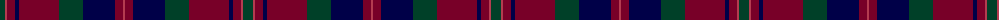

The parent of this is [Diana Princess of Wales (Fashion)](/tartans/dg/10/r2/dr8/db4/dr40/dg24/db32/dr8/r/2/)

This was sourced from tartans-authority.  It is a [9 stripes tartan](/stripes/stripes9/).

Original link http://www.tartansauthority.com/tartan-ferret/display/4683/

## Thread count
DG/10 R2 DR8 DB4 DR40 DG24 DB32 DR8 R/2

## Palette
Each colour and its ΔE from the base-6 reference it is a variant of.

| Colour | Shade | Base | ΔE (OKLab) |
|---|---|---|---|
| DB |  `#000048` | B  | 0.21 |
| DG |  `#004028` | G  | 0.14 |
| DR |  `#780028` | R  | 0.18 |
| R |  `#B43C50` | R  | 0.08 |

ID: /variants/dg/10/r2/dr8/db4/dr40/dg24/db32/dr8/r/2-db000048-dg004028-dr780028-rb43c50/
