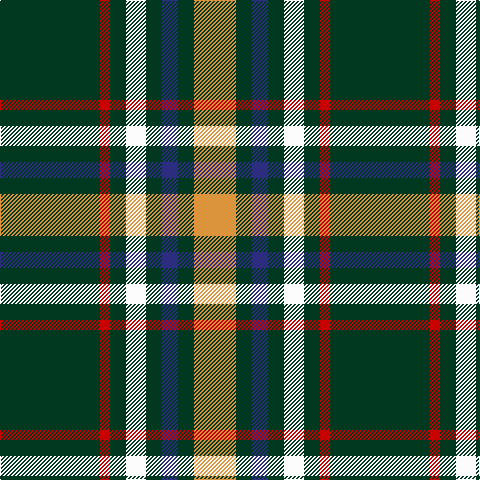

The parent of this is [St. Patrick's Krewe (Corporate)](/tartans/dg/100/r10/dg16/w20/dg16/db16/dg16/o/42/)

This was sourced from tartans-authority.  It is a [8 stripes tartan](/stripes/stripes8/).

Original link http://www.tartansauthority.com/tartan-ferret/display/10548/

## Thread count
DG/100 R10 DG16 W20 DG16 DB16 DG16 O/42

## Palette
Each colour and its ΔE from the base-6 reference it is a variant of.

| Colour | Shade | Base | ΔE (OKLab) |
|---|---|---|---|
| DB |  `#2C2C80` | B  | 0.05 |
| DG |  `#003820` | G  | 0.16 |
| O |  `#DC943C` | Y  | 0.12 |
| R |  `#C80000` | R  | 0.00 |
| W |  `#FCFCFC` | W  | 0.03 |

# Sample pattern

ID: /variants/dg/100/r10/dg16/w20/dg16/db16/dg16/o/42-db2c2c80-dg003820-odc943c-rc80000-wfcfcfc/
