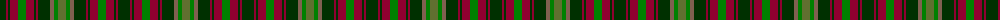

The parent of this is [Maple Leaf](/tartans/dg/12/dr2/dg2/dr8/ga8/dr8/dg2/dr2/dg12/lt4/ga4/g/8/)

This was sourced from weddslist.  It is a [12 stripes tartan](/stripes/stripes12/).

Original link http://www.weddslist.com/cgi-bin/tartans/pg.pl?source=sts

## Thread count
DG/12 DR2 DG2 DR8 Ga8 DR8 DG2 DR2 DG12 LT4 Ga4 G/8

## Palette
Each colour and its ΔE from the base-6 reference it is a variant of.

| Colour | Shade | Base | ΔE (OKLab) |
|---|---|---|---|
| DG |  `#003000` | G  | 0.18 |
| DR |  `#900030` | R  | 0.13 |
| G |  `#607030` | G  | 0.11 |
| Ga |  `#008000` | G  | 0.09 |
| LT |  `#806050` | R  | 0.17 |

ID: /variants/dg/12/dr2/dg2/dr8/ga8/dr8/dg2/dr2/dg12/lt4/ga4/g/8-dg003000-dr900030-g607030-ga008000-lt806050/
