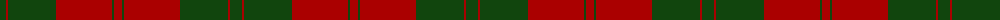
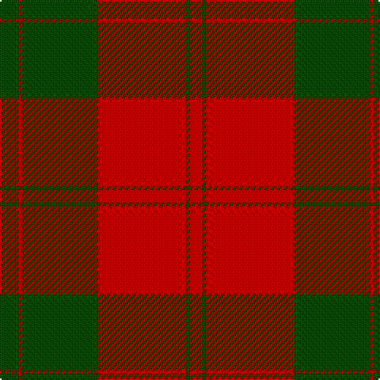

The parent of this is [Erskine](/tartans/dg/12/dr2/dg48/dr56/dg2/dr/8/)

This was sourced from weddslist.  It is a [6 stripes tartan](/stripes/stripes6/).

Original link http://www.weddslist.com/cgi-bin/tartans/pg.pl?source=x

## Thread count
DG/12 DR2 DG48 DR56 DG2 DR/8

## Palette
Each colour and its ΔE from the base-6 reference it is a variant of.

| Colour | Shade | Base | ΔE (OKLab) |
|---|---|---|---|
| DG |  `#11450D` | G  | 0.10 |
| DR |  `#AA0000` | R  | 0.06 |

# Sample pattern

ID: /variants/dg/12/dr2/dg48/dr56/dg2/dr/8-dg11450d-draa0000/
