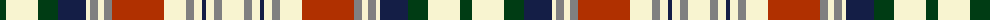

The parent of this is [Stuart-Houghton Dress (Personal)](/tartans/dg/12/ly32/dg20/db28/ly4/n8/ly6/n8/r52/ly22/n8/ly8/db4/ly8/n8/ly/22/)

This was sourced from register-of-tartans.  It is a [16 stripes tartan](/stripes/stripes16/).

Original link https://www.tartanregister.gov.uk/tartanDetails.aspx?ref=11085

## Thread count
DG/12 LY32 DG20 DB28 LY4 N8 LY6 N8 R52 LY22 N8 LY8 DB4 LY8 N8 LY/22

## Palette
Each colour and its ΔE from the base-6 reference it is a variant of.

| Colour | Shade | Base | ΔE (OKLab) |
|---|---|---|---|
| DB |  `#141E46` | B  | 0.15 |
| DG |  `#003C14` | G  | 0.14 |
| LY |  `#F8F4D0` | W  | 0.04 |
| N |  `#808080` | G  | 0.22 |
| R |  `#B03000` | R  | 0.05 |

ID: /variants/dg/12/ly32/dg20/db28/ly4/n8/ly6/n8/r52/ly22/n8/ly8/db4/ly8/n8/ly/22-db141e46-dg003c14-lyf8f4d0-n808080-rb03000/
