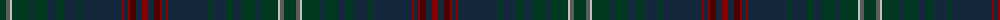

The parent of this is [Queensferry](/tartans/dg/12/n4/na2/dg18/dn4/dg14/dn8/dg8/dn14/dg4/dn40/dr2/dn4/dr2/dra6/dn6/dr/6/)

This was sourced from register-of-tartans.  It is a [17 stripes tartan](/stripes/stripes17/).

Original link https://www.tartanregister.gov.uk/tartanDetails.aspx?ref=3430

## Thread count
DG/12 N4 Na2 DG18 DN4 DG14 DN8 DG8 DN14 DG4 DN40 DR2 DN4 DR2 DRa6 DN6 DR/6

## Palette
Each colour and its ΔE from the base-6 reference it is a variant of.

| Colour | Shade | Base | ΔE (OKLab) |
|---|---|---|---|
| DG |  `#003820` | G  | 0.16 |
| DN |  `#14283C` | B  | 0.14 |
| DR |  `#880000` | R  | 0.14 |
| DRa |  `#4C0000` | B  | 0.24 |
| N |  `#5C5C5C` | B  | 0.14 |
| Na |  `#C0C0C0` | W  | 0.16 |

ID: /variants/dg/12/n4/na2/dg18/dn4/dg14/dn8/dg8/dn14/dg4/dn40/dr2/dn4/dr2/dra6/dn6/dr/6-dg003820-dn14283c-dr880000-dra4c0000-n5c5c5c-nac0c0c0/
