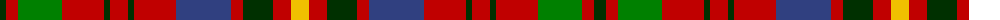

The parent of this is [Unidentified Plaid 16](/tartans/dg/12/r12/g44/r42/dg6/r18/dg6/r42/b55/r12/dg30/r18/y/18/)

This was sourced from weddslist.  It is a [13 stripes tartan](/stripes/stripes13/).

Original link http://www.weddslist.com/cgi-bin/tartans/pg.pl?source=sts

## Thread count
DG/12 R12 G44 R42 DG6 R18 DG6 R42 B55 R12 DG30 R18 Y/18

## Palette
Each colour and its ΔE from the base-6 reference it is a variant of.

| Colour | Shade | Base | ΔE (OKLab) |
|---|---|---|---|
| B |  `#304080` | B  | 0.01 |
| DG |  `#003000` | G  | 0.18 |
| G |  `#008000` | G  | 0.09 |
| R |  `#C00000` | R  | 0.02 |
| Y |  `#F0C000` | Y  | 0.01 |

ID: /variants/dg/12/r12/g44/r42/dg6/r18/dg6/r42/b55/r12/dg30/r18/y/18-b304080-dg003000-g008000-rc00000-yf0c000/
