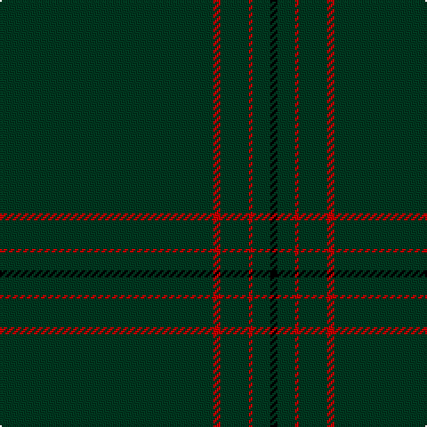

The parent of this is [St. David's (District)](/tartans/dg/120/r4/dg16/r2/dg10/k/4/)

This was sourced from tartans-authority.  It is a [6 stripes tartan](/stripes/stripes6/).

Original link http://www.tartansauthority.com/tartan-ferret/display/5746/

## Thread count
DG/120 R4 DG16 R2 DG10 K/4

## Palette
Each colour and its ΔE from the base-6 reference it is a variant of.

| Colour | Shade | Base | ΔE (OKLab) |
|---|---|---|---|
| DG |  `#003820` | G  | 0.16 |
| DGa |  `#003820` | G  | 0.16 |
| DGb |  `#003820` | G  | 0.16 |
| K |  `#000000` | K  | 0.00 |
| R |  `#C80000` | R  | 0.00 |

# Sample pattern

ID: /variants/dg/120/r4/dg16/r2/dg10/k/4-dg003820-dga003820-dgb003820-k000000-rc80000/
