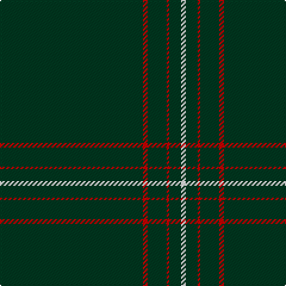

The parent of this is [St. David's Welsh District Tartan Tartan Number: 5746. Earliest known date: 2002 Representing the colours of Wales, this national tartan is recognised in Wales as The Brithwe Dewi Sant, or The Saint Davids Tartan, exclusively woven in Wales by The Cambrian Woollen Mill, in Llanwrtyd Wells, Powys. Launched at Cardiff Castle in honour of the Welsh Patron Saint, and worn by Welsh folk around the world for special occasions including St Davids Day, March 1st. A differing warp and weft create a vertical stripe in these Welsh Tartans. See products available Copyright © Blair Urquhart, Comrie, 2015](/tartans/dg/120/r4/dg16/r2/dg10/w/4/)

This was sourced from house-of-tartan.  It is a [6 stripes tartan](/stripes/stripes6/).

Original link http://www.house-of-tartan.scotland.net/house/TartanViewjs.asp?colr=Def&tnam=5746

## Thread count
DG/120 R4 DG16 R2 DG10 W/4

## Palette
Each colour and its ΔE from the base-6 reference it is a variant of.

| Colour | Shade | Base | ΔE (OKLab) |
|---|---|---|---|
| DG |  `#003820` | G  | 0.16 |
| DR |  `#880000` | R  | 0.14 |
| G |  `#285800` | G  | 0.04 |
| Ga |  `#006818` | G  | 0.02 |
| Gb |  `#289C18` | G  | 0.18 |
| LN |  `#E0E0E0` | W  | 0.06 |
| R |  `#C80000` | R  | 0.00 |
| W |  `#FCFCFC` | W  | 0.03 |

# Sample pattern

ID: /variants/dg/120/r4/dg16/r2/dg10/w/4-dg003820-dr880000-g285800-ga006818-gb289c18-lne0e0e0-rc80000-wfcfcfc/
