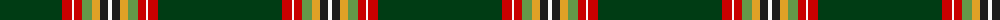

The parent of this is [Greeven, Wolfgang H (Personal)](/tartans/dg/124/r10/w2/r8/lg10/y8/k8/w/4/)

This was sourced from register-of-tartans.  It is a [8 stripes tartan](/stripes/stripes8/).

Original link https://www.tartanregister.gov.uk/tartanDetails.aspx?ref=11425

## Thread count
DG/124 R10 W2 R8 LG10 Y8 K8 W/4

## Palette
Each colour and its ΔE from the base-6 reference it is a variant of.

| Colour | Shade | Base | ΔE (OKLab) |
|---|---|---|---|
| DG |  `#003C14` | G  | 0.14 |
| K |  `#1C1C1C` | B  | 0.20 |
| LG |  `#649848` | G  | 0.19 |
| R |  `#C80000` | R  | 0.00 |
| W |  `#F8F8F8` | W  | 0.01 |
| Y |  `#E0A126` | Y  | 0.08 |

# Sample pattern

ID: /variants/dg/124/r10/w2/r8/lg10/y8/k8/w/4-dg003c14-k1c1c1c-lg649848-rc80000-wf8f8f8-ye0a126/
