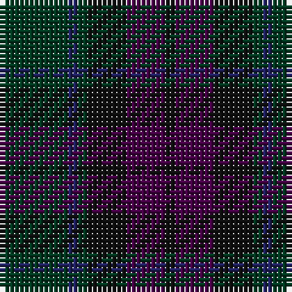

The parent of this is [MacArthur of Milton Hunting](/tartans/dg/14/db2/dg2/k8/dp8/k/2/)

This was sourced from register-of-tartans.  It is a [6 stripes tartan](/stripes/stripes6/).

Original link https://www.tartanregister.gov.uk/tartanDetails.aspx?ref=2281

## Thread count
DG/14 DB2 DG2 K8 DP8 K/2

## Palette
Each colour and its ΔE from the base-6 reference it is a variant of.

| Colour | Shade | Base | ΔE (OKLab) |
|---|---|---|---|
| DB |  `#202060` | B  | 0.11 |
| DG |  `#003820` | G  | 0.16 |
| DP |  `#440044` | B  | 0.17 |
| K |  `#101010` | K  | 0.17 |

# Sample pattern

ID: /variants/dg/14/db2/dg2/k8/dp8/k/2-db202060-dg003820-dp440044-k101010/
