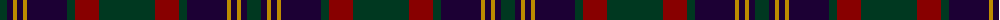

The parent of this is [Cork, County (District)](/tartans/dg/14/db6/dy4/db6/dy4/db40/dg8/dr24/dg/56/)

This was sourced from tartans-authority.  It is a [9 stripes tartan](/stripes/stripes9/).

Original link http://www.tartansauthority.com/tartan-ferret/display/2253/

## Thread count
DG/14 DB6 DY4 DB6 DY4 DB40 DG8 DR24 DG/56

## Palette
Each colour and its ΔE from the base-6 reference it is a variant of.

| Colour | Shade | Base | ΔE (OKLab) |
|---|---|---|---|
| DB |  `#1C0034` | K  | 0.21 |
| DG |  `#003820` | G  | 0.16 |
| DR |  `#880000` | R  | 0.14 |
| DY |  `#BC8C00` | Y  | 0.16 |

ID: /variants/dg/14/db6/dy4/db6/dy4/db40/dg8/dr24/dg/56-db1c0034-dg003820-dr880000-dybc8c00/
