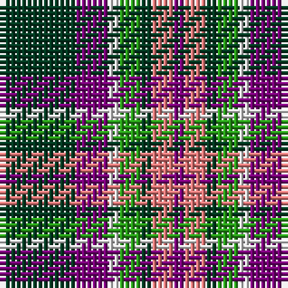

The parent of this is [Lindley-Highfield (Name)](/tartans/dg/14/p6/ln2/g4/dg2/lr4/p/2/)

This was sourced from tartans-authority.  It is a [7 stripes tartan](/stripes/stripes7/).

Original link http://www.tartansauthority.com/tartan-ferret/display/10002/

## Thread count
DG/14 P6 LN2 G4 DG2 LR4 P/2

## Palette
Each colour and its ΔE from the base-6 reference it is a variant of.

| Colour | Shade | Base | ΔE (OKLab) |
|---|---|---|---|
| DG |  `#003820` | G  | 0.16 |
| G |  `#289C18` | G  | 0.18 |
| LN |  `#E0E0E0` | W  | 0.06 |
| LR |  `#E87878` | R  | 0.19 |
| P |  `#780078` | B  | 0.16 |

# Sample pattern

ID: /variants/dg/14/p6/ln2/g4/dg2/lr4/p/2-dg003820-g289c18-lne0e0e0-lre87878-p780078/
