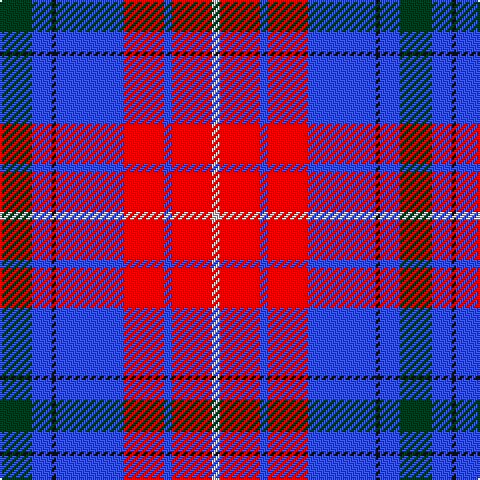

The parent of this is [Harrower, John Anthony (Personal)](/tartans/dg/16/b10/k2/b34/r20/b4/r20/n/4/)

This was sourced from register-of-tartans.  It is a [8 stripes tartan](/stripes/stripes8/).

Original link https://www.tartanregister.gov.uk/tartanDetails.aspx?ref=11205

## Thread count
DG/16 B10 K2 B34 R20 B4 R20 N/4

## Palette
Each colour and its ΔE from the base-6 reference it is a variant of.

| Colour | Shade | Base | ΔE (OKLab) |
|---|---|---|---|
| B |  `#3850C8` | B  | 0.12 |
| DG |  `#003820` | G  | 0.16 |
| K |  `#101010` | K  | 0.17 |
| N |  `#C8C8C8` | W  | 0.13 |
| R |  `#FF0000` | R  | 0.11 |

# Sample pattern

ID: /variants/dg/16/b10/k2/b34/r20/b4/r20/n/4-b3850c8-dg003820-k101010-nc8c8c8-rff0000/
