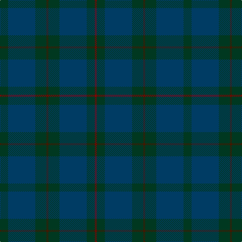

The parent of this is [Hector, James](/tartans/dg/16/db54/dg22/dr4/dg22/db54/dg16/dra/4/)

This was sourced from register-of-tartans.  It is a [8 stripes tartan](/stripes/stripes8/).

Original link https://www.tartanregister.gov.uk/tartanDetails.aspx?ref=1676

## Thread count
DG/16 DB54 DG22 DR4 DG22 DB54 DG16 DRa/4

## Palette
Each colour and its ΔE from the base-6 reference it is a variant of.

| Colour | Shade | Base | ΔE (OKLab) |
|---|---|---|---|
| DB |  `#003C64` | B  | 0.07 |
| DG |  `#003820` | G  | 0.16 |
| DR |  `#441800` | B  | 0.22 |
| DRa |  `#880000` | R  | 0.14 |

# Sample pattern

ID: /variants/dg/16/db54/dg22/dr4/dg22/db54/dg16/dra/4-db003c64-dg003820-dr441800-dra880000/
