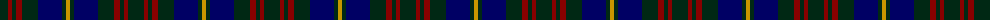

The parent of this is [Glen Nevis #1](/tartans/dg/16/dr4/dg4/dr6/dg16/db24/dg4/dy/4/)

This was sourced from register-of-tartans.  It is a [8 stripes tartan](/stripes/stripes8/).

Original link https://www.tartanregister.gov.uk/tartanDetails.aspx?ref=1389

## Thread count
DG/16 DR4 DG4 DR6 DG16 DB24 DG4 DY/4

## Palette
Each colour and its ΔE from the base-6 reference it is a variant of.

| Colour | Shade | Base | ΔE (OKLab) |
|---|---|---|---|
| DB |  `#000064` | B  | 0.17 |
| DG |  `#002814` | B  | 0.21 |
| DR |  `#880000` | R  | 0.14 |
| DY |  `#C89600` | Y  | 0.12 |

# Sample pattern

ID: /variants/dg/16/dr4/dg4/dr6/dg16/db24/dg4/dy/4-db000064-dg002814-dr880000-dyc89600/
