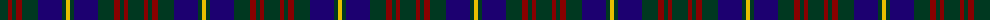

The parent of this is [Glen Nevis #1 (Fashion)](/tartans/dg/16/dr4/dg4/dr6/dg16/db24/dg4/y/4/)

This was sourced from tartans-authority.  It is a [8 stripes tartan](/stripes/stripes8/).

Original link http://www.tartansauthority.com/tartan-ferret/display/5017/

## Thread count
DG/16 DR4 DG4 DR6 DG16 DB24 DG4 Y/4

## Palette
Each colour and its ΔE from the base-6 reference it is a variant of.

| Colour | Shade | Base | ΔE (OKLab) |
|---|---|---|---|
| DB |  `#1C0070` | B  | 0.14 |
| DG |  `#003820` | G  | 0.16 |
| DR |  `#880000` | R  | 0.14 |
| Y |  `#E8C000` | Y  | 0.00 |

# Sample pattern

ID: /variants/dg/16/dr4/dg4/dr6/dg16/db24/dg4/y/4-db1c0070-dg003820-dr880000-ye8c000/
