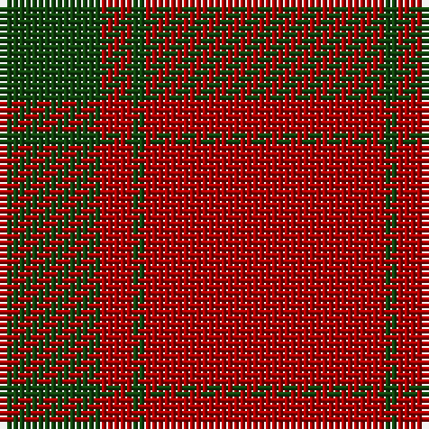

The parent of this is [MacDonald Lord of the Isles](/tartans/dg/16/dr5/dg2/dr/38/)

This was sourced from weddslist.  It is a [4 stripes tartan](/stripes/stripes4/).

Original link http://www.weddslist.com/cgi-bin/tartans/pg.pl?source=x

## Thread count
DG/16 DR5 DG2 DR/38

## Palette
Each colour and its ΔE from the base-6 reference it is a variant of.

| Colour | Shade | Base | ΔE (OKLab) |
|---|---|---|---|
| DG |  `#11450D` | G  | 0.10 |
| DR |  `#AA0000` | R  | 0.06 |

# Sample pattern

ID: /variants/dg/16/dr5/dg2/dr/38-dg11450d-draa0000/
