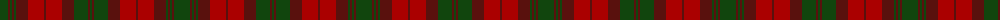

The parent of this is [MacNab](/tartans/dg/16/dra2/dg2/dra2/dg2/dra12/dr16/dra2/dr16/dra12/dg14/dra2/dg/2/)

This was sourced from weddslist.  It is a [13 stripes tartan](/stripes/stripes13/).

Original link http://www.weddslist.com/cgi-bin/tartans/pg.pl?source=x

## Thread count
DG/16 DRa2 DG2 DRa2 DG2 DRa12 DR16 DRa2 DR16 DRa12 DG14 DRa2 DG/2

## Palette
Each colour and its ΔE from the base-6 reference it is a variant of.

| Colour | Shade | Base | ΔE (OKLab) |
|---|---|---|---|
| DG |  `#11450D` | G  | 0.10 |
| DR |  `#AA0000` | R  | 0.06 |
| DRa |  `#59110D` | B  | 0.21 |

ID: /variants/dg/16/dra2/dg2/dra2/dg2/dra12/dr16/dra2/dr16/dra12/dg14/dra2/dg/2-dg11450d-draa0000-dra59110d/
