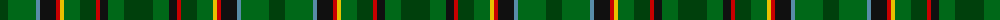

The parent of this is [MacCamley Clan Tartan Tartan Number: 7241. Earliest known date: 2007 For the wedding of Andrew McCamley See products available Copyright © Blair Urquhart, Comrie, 2015](/tartans/dg/16/g28/b4/k16/r4/y4/g16/dg16/r4/k8/g16/dg/29/)

This was sourced from house-of-tartan.  It is a [12 stripes tartan](/stripes/stripes12/).

Original link http://www.house-of-tartan.scotland.net/house/TartanViewjs.asp?colr=Def&tnam=7241

## Thread count
DG/16 G28 B4 K16 R4 Y4 G16 DG16 R4 K8 G16 DG/29

## Palette
Each colour and its ΔE from the base-6 reference it is a variant of.

| Colour | Shade | Base | ΔE (OKLab) |
|---|---|---|---|
| B |  `#588CA8` | B  | 0.23 |
| DB |  `#202060` | B  | 0.11 |
| DG |  `#00400C` | G  | 0.12 |
| DR |  `#880000` | R  | 0.14 |
| G |  `#006818` | G  | 0.02 |
| K |  `#101010` | K  | 0.17 |
| LN |  `#E0E0E0` | W  | 0.06 |
| R |  `#C80000` | R  | 0.00 |
| Y |  `#E8C000` | Y  | 0.00 |

ID: /variants/dg/16/g28/b4/k16/r4/y4/g16/dg16/r4/k8/g16/dg/29-b588ca8-db202060-dg00400c-dr880000-g006818-k101010-lne0e0e0-rc80000-ye8c000/
