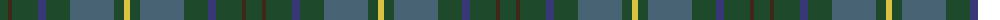
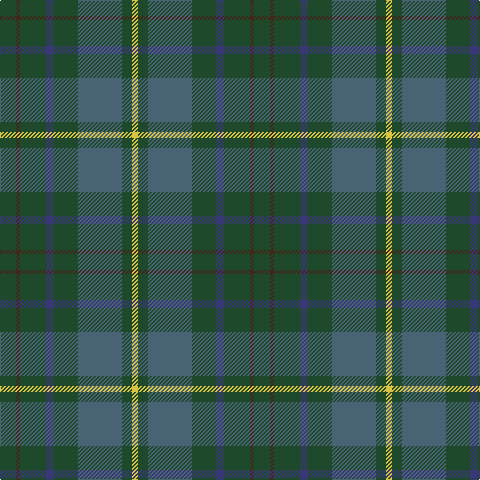

The parent of this is [Scottish Pup](/tartans/dg/16/t4/dg26/db8/dg24/n44/dg10/y/6/)

This was sourced from register-of-tartans.  It is a [8 stripes tartan](/stripes/stripes8/).

Original link https://www.tartanregister.gov.uk/tartanDetails.aspx?ref=10231

## Thread count
DG/16 T4 DG26 DB8 DG24 N44 DG10 Y/6

## Palette
Each colour and its ΔE from the base-6 reference it is a variant of.

| Colour | Shade | Base | ΔE (OKLab) |
|---|---|---|---|
| DB |  `#373875` | B  | 0.03 |
| DG |  `#1E492B` | G  | 0.11 |
| N |  `#486373` | B  | 0.12 |
| T |  `#412719` | B  | 0.18 |
| Y |  `#D9C341` | Y  | 0.03 |

# Sample pattern

ID: /variants/dg/16/t4/dg26/db8/dg24/n44/dg10/y/6-db373875-dg1e492b-n486373-t412719-yd9c341/
