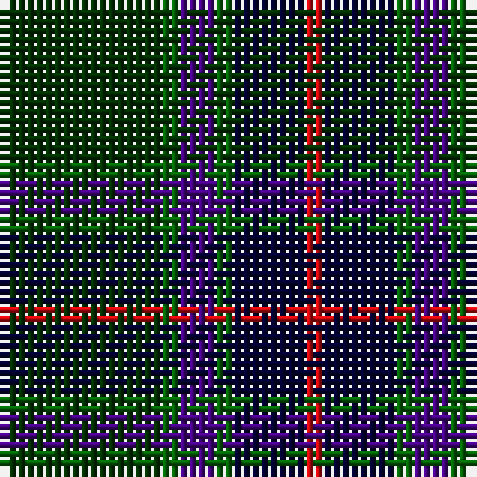

The parent of this is [Gorman, George (Personal)](/tartans/dg/18/g2/p4/g2/db8/r/2/)

This was sourced from register-of-tartans.  It is a [6 stripes tartan](/stripes/stripes6/).

Original link https://www.tartanregister.gov.uk/tartanDetails.aspx?ref=10029

## Thread count
DG/18 G2 P4 G2 DB8 R/2

## Palette
Each colour and its ΔE from the base-6 reference it is a variant of.

| Colour | Shade | Base | ΔE (OKLab) |
|---|---|---|---|
| DB |  `#020031` | K  | 0.17 |
| DG |  `#003000` | G  | 0.18 |
| G |  `#026306` | G  | 0.00 |
| P |  `#450082` | B  | 0.12 |
| R |  `#CB080C` | R  | 0.01 |

# Sample pattern

ID: /variants/dg/18/g2/p4/g2/db8/r/2-db020031-dg003000-g026306-p450082-rcb080c/
