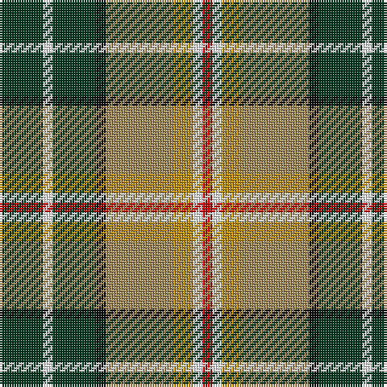

The parent of this is [MacShane (Clan)](/tartans/dg/18/w4/dg18/k4/lt28/dy8/w4/r/4/)

This was sourced from tartans-authority.  It is a [8 stripes tartan](/stripes/stripes8/).

Original link http://www.tartansauthority.com/tartan-ferret/display/3571/

## Thread count
DG/18 W4 DG18 K4 LT28 DY8 W4 R/4

## Palette
Each colour and its ΔE from the base-6 reference it is a variant of.

| Colour | Shade | Base | ΔE (OKLab) |
|---|---|---|---|
| DG |  `#003820` | G  | 0.16 |
| DY |  `#BC8C00` | Y  | 0.16 |
| K |  `#101010` | K  | 0.17 |
| LT |  `#A08858` | Y  | 0.21 |
| R |  `#C80000` | R  | 0.00 |
| W |  `#FCFCFC` | W  | 0.03 |

# Sample pattern

ID: /variants/dg/18/w4/dg18/k4/lt28/dy8/w4/r/4-dg003820-dybc8c00-k101010-lta08858-rc80000-wfcfcfc/
