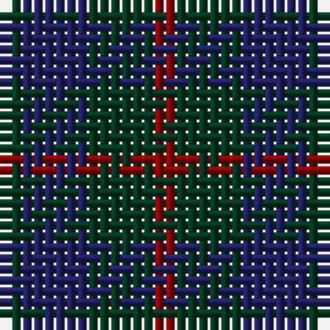

The parent of this is [Barwell](/tartans/dg/2/db6/dg6/dr/2/)

This was sourced from register-of-tartans.  It is a [4 stripes tartan](/stripes/stripes4/).

Original link https://www.tartanregister.gov.uk/tartanDetails.aspx?ref=4966

## Thread count
DG/2 DB6 DG6 DR/2

## Palette
Each colour and its ΔE from the base-6 reference it is a variant of.

| Colour | Shade | Base | ΔE (OKLab) |
|---|---|---|---|
| DB |  `#202060` | B  | 0.11 |
| DG |  `#003820` | G  | 0.16 |
| DR |  `#880000` | R  | 0.14 |

# Sample pattern

ID: /variants/dg/2/db6/dg6/dr/2-db202060-dg003820-dr880000/
