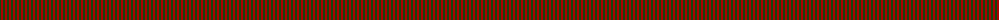
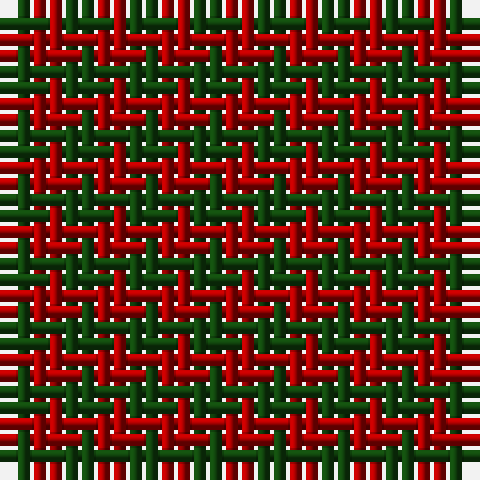

The parent of this is [Moncreiffe](/tartans/dg/2/dr/2/)

This was sourced from weddslist.  It is a [2 stripes tartan](/stripes/stripes2/).

Original link http://www.weddslist.com/cgi-bin/tartans/pg.pl?source=tinsel

## Thread count
DG/2 DR/2

## Palette
DG DR

# Sample pattern

ID: /variants/dg/2/dr/2-dg11450d-draa0000/
