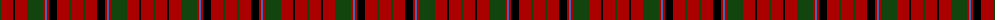

The parent of this is [MacNicol](/tartans/dg/2/dr12/k2/dr12/dg16/dr2/b2/dr2/k8/dr12/dg2/dr/12/)

This was sourced from weddslist.  It is a [12 stripes tartan](/stripes/stripes12/).

Original link http://www.weddslist.com/cgi-bin/tartans/pg.pl?source=x

## Thread count
DG/2 DR12 K2 DR12 DG16 DR2 B2 DR2 K8 DR12 DG2 DR/12

## Palette
Each colour and its ΔE from the base-6 reference it is a variant of.

| Colour | Shade | Base | ΔE (OKLab) |
|---|---|---|---|
| B |  `#4367AE` | B  | 0.13 |
| DG |  `#11450D` | G  | 0.10 |
| DR |  `#AA0000` | R  | 0.06 |
| K |  `#000000` | K  | 0.00 |

ID: /variants/dg/2/dr12/k2/dr12/dg16/dr2/b2/dr2/k8/dr12/dg2/dr/12-b4367ae-dg11450d-draa0000-k000000/
