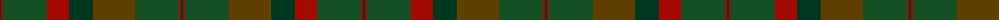

The parent of this is [MacNaughton Htg](/tartans/dg/2/dr2/g44/dr22/dg24/t42/g44/dr2/dg/2/)

This was sourced from tartans-authority.  It is a [9 stripes tartan](/stripes/stripes9/).

Original link http://www.tartansauthority.com/tartan-ferret/display/7852/

## Thread count
DG/2 DR2 G44 DR22 DG24 T42 G44 DR2 DG/2

## Palette
Each colour and its ΔE from the base-6 reference it is a variant of.

| Colour | Shade | Base | ΔE (OKLab) |
|---|---|---|---|
| DG |  `#003820` | G  | 0.16 |
| DR |  `#A40800` | R  | 0.08 |
| G |  `#145024` | G  | 0.08 |
| T |  `#604000` | G  | 0.14 |

ID: /variants/dg/2/dr2/g44/dr22/dg24/t42/g44/dr2/dg/2-dg003820-dra40800-g145024-t604000/
