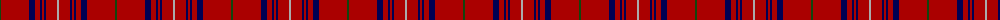

The parent of this is [Rose](/tartans/dg/2/dr28/db6/dr5/db2/dr2/db2/dr11/n/2/)

This was sourced from weddslist.  It is a [9 stripes tartan](/stripes/stripes9/).

Original link http://www.weddslist.com/cgi-bin/tartans/pg.pl?source=x

## Thread count
DG/2 DR28 DB6 DR5 DB2 DR2 DB2 DR11 N/2

## Palette
Each colour and its ΔE from the base-6 reference it is a variant of.

| Colour | Shade | Base | ΔE (OKLab) |
|---|---|---|---|
| DB |  `#000052` | B  | 0.20 |
| DG |  `#11450D` | G  | 0.10 |
| DR |  `#AA0000` | R  | 0.06 |
| N |  `#AAAAAA` | Y  | 0.19 |

ID: /variants/dg/2/dr28/db6/dr5/db2/dr2/db2/dr11/n/2-db000052-dg11450d-draa0000-naaaaaa/
