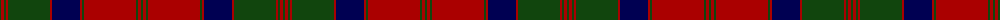

The parent of this is [MacQuarrie 1815](/tartans/dg/2/dr3/dg2/dr2/dg42/dr2/db28/dr2/dg2/dr52/dg2/dr3/dg/2/)

This was sourced from weddslist.  It is a [13 stripes tartan](/stripes/stripes13/).

Original link http://www.weddslist.com/cgi-bin/tartans/pg.pl?source=x

## Thread count
DG/2 DR3 DG2 DR2 DG42 DR2 DB28 DR2 DG2 DR52 DG2 DR3 DG/2

## Palette
Each colour and its ΔE from the base-6 reference it is a variant of.

| Colour | Shade | Base | ΔE (OKLab) |
|---|---|---|---|
| DB |  `#000052` | B  | 0.20 |
| DG |  `#11450D` | G  | 0.10 |
| DR |  `#AA0000` | R  | 0.06 |

ID: /variants/dg/2/dr3/dg2/dr2/dg42/dr2/db28/dr2/dg2/dr52/dg2/dr3/dg/2-db000052-dg11450d-draa0000/
