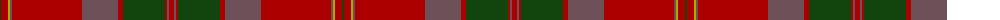

The parent of this is [MacPherson Of Cluny](/tartans/dg/2/dr7/lg2/n2/dr70/n36/dr5/dg42/dr2/n2/dr/5/)

This was sourced from weddslist.  It is a [11 stripes tartan](/stripes/stripes11/).

Original link http://www.weddslist.com/cgi-bin/tartans/pg.pl?source=x

## Thread count
DG/2 DR7 LG2 N2 DR70 N36 DR5 DG42 DR2 N2 DR/5

## Palette
Each colour and its ΔE from the base-6 reference it is a variant of.

| Colour | Shade | Base | ΔE (OKLab) |
|---|---|---|---|
| DG |  `#11450D` | G  | 0.10 |
| DR |  `#AA0000` | R  | 0.06 |
| LG |  `#AAAA00` | Y  | 0.11 |
| N |  `#6E5058` | B  | 0.14 |

ID: /variants/dg/2/dr7/lg2/n2/dr70/n36/dr5/dg42/dr2/n2/dr/5-dg11450d-draa0000-lgaaaa00-n6e5058/
