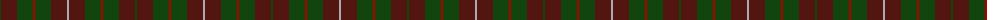

The parent of this is [MacKinnon Hunting](/tartans/dg/2/dra16/dg16/dr2/dg16/dra16/n/2/)

This was sourced from weddslist.  It is a [7 stripes tartan](/stripes/stripes7/).

Original link http://www.weddslist.com/cgi-bin/tartans/pg.pl?source=x

## Thread count
DG/2 DRa16 DG16 DR2 DG16 DRa16 N/2

## Palette
Each colour and its ΔE from the base-6 reference it is a variant of.

| Colour | Shade | Base | ΔE (OKLab) |
|---|---|---|---|
| DG |  `#11450D` | G  | 0.10 |
| DR |  `#AA0000` | R  | 0.06 |
| DRa |  `#521510` | B  | 0.21 |
| N |  `#AAAAAA` | Y  | 0.19 |

# Sample pattern

ID: /variants/dg/2/dra16/dg16/dr2/dg16/dra16/n/2-dg11450d-draa0000-dra521510-naaaaaa/
